# CareTwin: GPU training and test results (Review 2)

All models were trained and tested on the base paper's real published dataset
(Momand et al., IEEE Access 2025, [EDT-Datasets](https://github.com/mommand/EDT-Datasets), Fitbit Sense 2).
Nothing here uses mock data. Every number below is read from `results/*.json` and `results/eval/eval_metrics.json`,
and every figure is regenerated by the two commands in [Reproduce](#reproduce).

| Run detail | Value |
|---|---|
| Hardware | NVIDIA GeForce RTX 4050 Laptop GPU (6 GB), driver 610.62 |
| Software | Python 3.12.5, PyTorch 2.11.0 + CUDA 12.8 |
| Training | `run_all.py` full run (not smoke), 3,051 s (about 51 min) |
| Testing | `evaluate.py` on held-out data; RandomForest and GAN sampling seeded, re-run gave identical numbers |
| Full console output | [`results/train_log.txt`](results/train_log.txt), [`results/eval_log.txt`](results/eval_log.txt) |

## Headline numbers

| Task | Model | Test result | Reference point |
|---|---|---|---|
| Next-step heart-rate forecast | Bi-LSTM | RMSE **1.82 bpm**, MAE 1.06 bpm, R² 0.992 | LSTM 1.83 bpm; persistence baseline 1.78 bpm |
| Sleep stage from HR + SpO₂ | LSTM (class-weighted) | balanced acc **0.711**, macro-F1 0.444, acc 0.534 | majority-class baseline: balanced acc 0.25, macro-F1 0.207 |
| Sleep-stage transitions | Markov chain (MLE) | next-step acc **0.953** | paper about 0.96; "stay in same stage" baseline 0.953 |
| Synthetic physiology | Conditional WGAN-GP | mean HR within **0.6 bpm** of real for every stage | train-on-synthetic reaches 79% of train-on-real macro-F1 |
| Minority augmentation | GAN, 3000 seq/class | wake recall **0.037 → 0.315**, REM **0.093 → 0.205** | accuracy 0.696 → 0.508; SMOTE macro-F1 0.376 vs GAN 0.315 |

**The short version.** Bi-LSTM beats LSTM on forecasting, which reproduces the paper's finding. The conditional GAN
(our contribution) learns realistic per-stage heart-rate and SpO₂ distributions. Adding its synthetic data raises
recall on the rare stages (wake up to 8.5x, REM up to 2.2x), but only by trading away overall accuracy, and on this
feature set it does not beat SMOTE or class weighting on macro-F1. The limiting factor is that heart rate, SpO₂ and
hour of night overlap heavily between sleep stages, not the number of minority samples. The details and honest
caveats are below.

---

## 1. Heart-rate forecasting (LSTM vs Bi-LSTM)

Task: predict the next reading from the previous 32 readings of the 589,282-row heart-rate series. 200,000 windows,
split by time (first 80% train, last 20% test, 40,000 test windows). HR standard deviation is 17.83 bpm.

| Model | MSE (standardized) | RMSE (bpm) | MAE (bpm) | R² | Within ±5 bpm |
|---|---|---|---|---|---|
| Persistence (next = last value) | 0.0100 | 1.784 | 0.896 | 0.9918 | 98.0% |
| LSTM | 0.0105 | 1.831 | 1.017 | 0.9914 | 97.7% |
| **Bi-LSTM** | **0.0104** | **1.821** | 1.058 | 0.9915 | 97.8% |

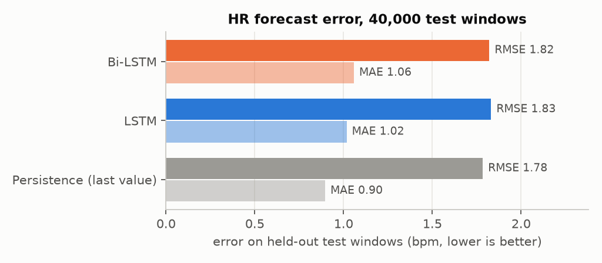
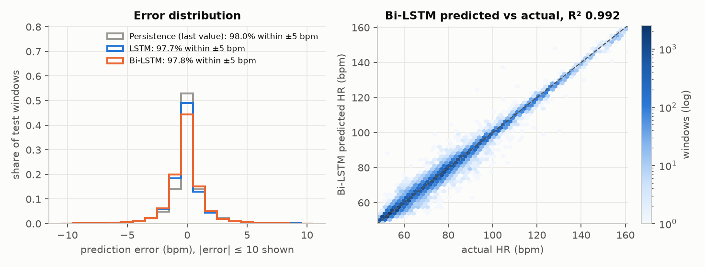
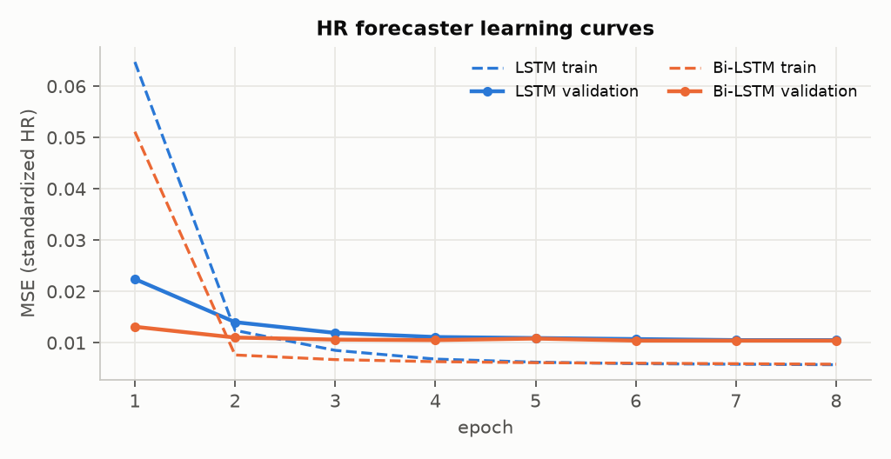
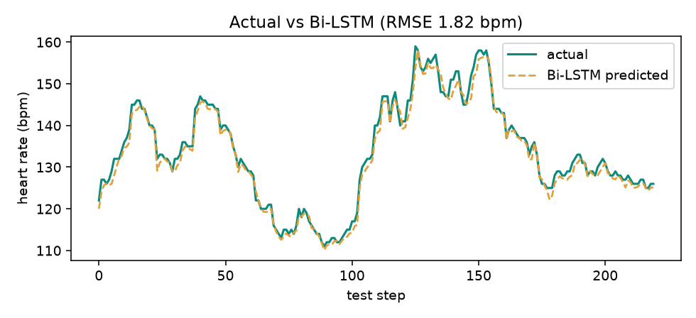

**Reading it honestly**

- Bi-LSTM beats LSTM on MSE and RMSE, the same ordering as the base paper (paper Bi-LSTM MSE 0.2944, LSTM 0.3256).
  Our absolute MSE is far lower because our task is next-step on a standardized, seconds-cadence series. The two
  numbers are not on the same scale, so the paper comparison is about ordering, not magnitude.
- At this cadence heart rate barely moves between readings, so simply repeating the last value is already very
  strong (RMSE 1.78 bpm). Both networks land within 0.05 bpm of it and learn a near-persistence mapping. A longer
  forecast horizon (for example 1 to 5 minutes ahead) is where a learned model would have room to add value. That
  is the natural next step for the forecaster.
- Learning curves show no overfitting: validation loss flattens by epoch 3 to 4 and does not rise afterwards.

## 2. Sleep-stage classification (LSTM)

Task: classify the sleep stage of a minute from the previous 10 minutes of [HR, SpO₂, hour]. 12,548 windows,
4 stages; the data is heavily imbalanced (light 70.5%, deep 21.8%, REM 5.6%, wake 2.1%). The model uses class
weights, so it is tuned to find rare stages rather than to maximise raw accuracy.

| Evaluation | Accuracy | Macro-F1 | Balanced acc | Recall deep / light / REM / wake |
|---|---|---|---|---|
| Majority baseline (always "light") | 0.705 | 0.207 | 0.250 | 0 / 1.00 / 0 / 0 |
| **LSTM, random split (as trained)** | 0.534 | **0.444** | **0.711** | 0.81 / 0.42 / 0.81 / 0.80 |
| LSTM, chronological split (stricter) | 0.550 | 0.381 | 0.519 | 0.69 / 0.53 / 0.25 / 0.60 |

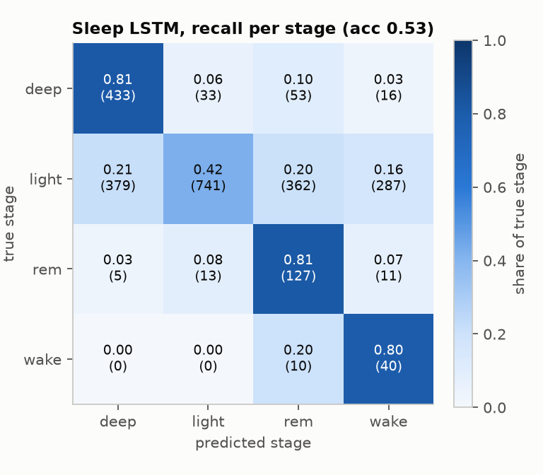
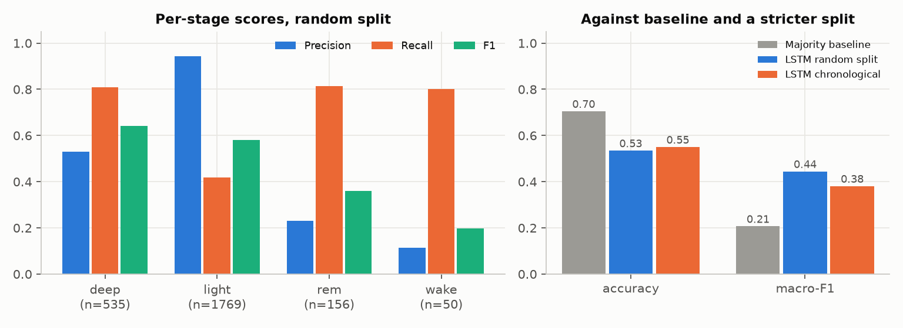

**Reading it honestly**

- Raw accuracy (0.534) is below the "always light" baseline (0.705). That is expected from class weighting: the
  model gives up easy "light" answers to catch the rare stages. On the metrics that respect imbalance it is far
  better than the baseline (balanced accuracy 0.711 vs 0.25, macro-F1 0.444 vs 0.207), and it finds 80% of
  wake minutes and 81% of REM minutes.
- The training script splits overlapping windows at random, so neighbouring windows can sit on both sides of
  the split. Retraining on a strict time-ordered split gives balanced accuracy 0.519 and macro-F1 0.381, which
  is the more conservative number to quote. REM is the stage most affected (recall 0.81 → 0.25).
- The paper reports 92% for its LSTM. We do not reach that with only HR, SpO₂ and time of night as inputs;
  the per-stage distributions in section 4 show why (the stages overlap heavily in these signals).

## 3. Sleep-stage transitions (Markov and Bayesian)

| Metric | Value |
|---|---|
| Markov next-step accuracy | 0.953 (50,580 transitions) |
| "Stay in the same stage" baseline | 0.953 |
| Stage changes in the data | 2,366 (4.7%) |
| Markov top-1 destination when the stage does change | 0.562 |

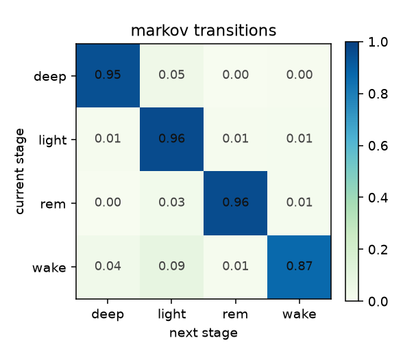
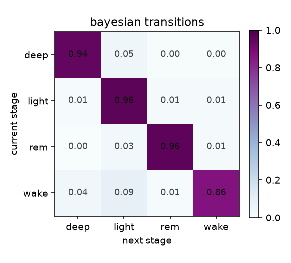

The 95.3% next-step accuracy matches the paper's figure of about 96%, but it equals the "stay put" baseline,
because stages persist for many minutes. The more informative number is that when a change happens, the chain
names the right next stage 56% of the time (chance among the 3 other stages is 33%). The Bayesian (Dirichlet)
matrix is a smoothed version for sparse rows such as wake.

## 4. Conditional WGAN-GP: synthetic physiology (our contribution)

A conditional Wasserstein GAN with gradient penalty generates 16-minute (HR, SpO₂) sequences for a requested
sleep stage. 12,542 real windows, 300 epochs, 5 critic steps per generator step.

| Stage | Real windows | HR mean real / GAN | HR sd real / GAN | SpO₂ mean real / GAN | HR Wasserstein (bpm) | Mean minute-to-minute HR change real / GAN |
|---|---|---|---|---|---|---|
| deep | 2,806 | 62.25 / 62.43 | 5.92 / 5.75 | 91.71 / 91.70 | 0.42 | 4.02 / 4.13 |
| light | 8,923 | 64.08 / 64.24 | 9.38 / 9.29 | 91.62 / 91.61 | 0.42 | 4.41 / 4.52 |
| REM | 613 | 62.52 / 63.09 | 8.88 / 8.89 | 92.11 / 92.07 | 0.92 | 4.45 / 4.53 |
| wake | 200 | 63.52 / 63.37 | 9.95 / 9.36 | 91.86 / 92.03 | 1.38 | 3.94 / 4.29 |

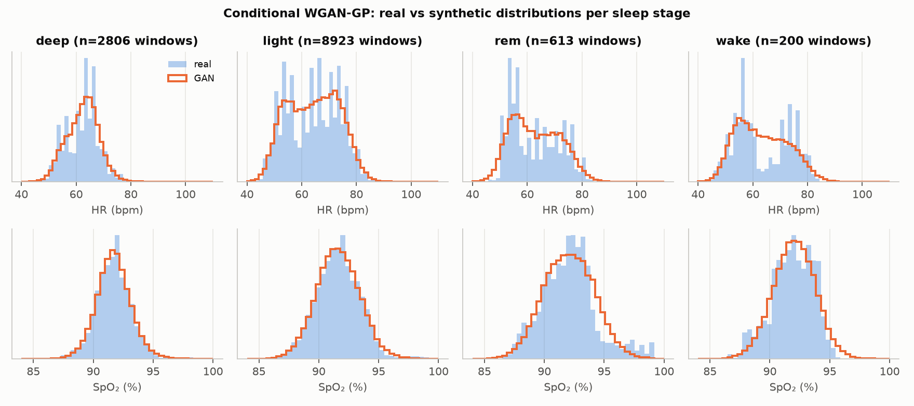
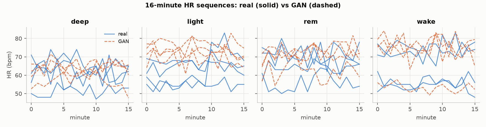
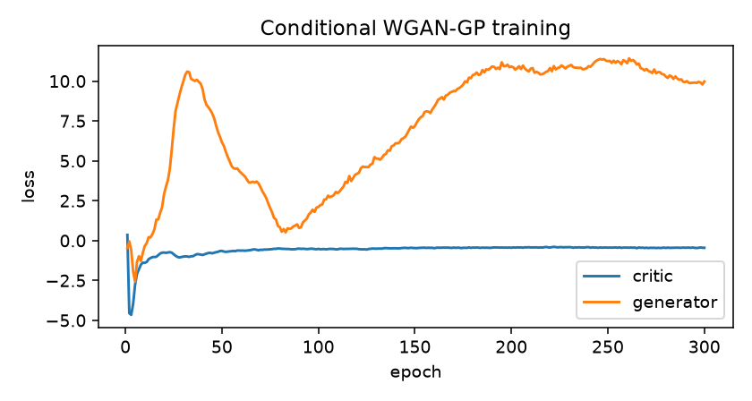

- **Fidelity is high.** Per-stage means match within 0.6 bpm and 0.2% SpO₂, spreads match, the GAN reproduces the
  two-peaked HR shape of light, REM and wake, and its minute-to-minute variability matches the real sequences.
  The critic loss (the negative of its Wasserstein-distance estimate) falls from about 4.6 early on to a stable
  0.45 by epoch 60 and stays there. The generator loss drifts, which is normal for WGANs, where it has no
  absolute meaning. The distributions above show no mode collapse.
- **The synthetic data carries real class signal.** A classifier trained only on synthetic windows and tested on
  real ones (TSTR) reaches macro-F1 0.304, which is 79% of the 0.386 from training on real windows (TRTR), with a
  time-ordered test split.
- As expected, fidelity is best for stages with the most data and weakest for wake (200 real windows).

## 5. Does GAN augmentation help the minority stages?

Same setup as `train_gan.py`: a RandomForest classifies single minutes from [HR, SpO₂, hour], stratified 80/20
split, 2,512 real test minutes. Minority stages are REM (561 training minutes) and wake (215) against light (7,080).
Every method is scored on the same untouched real test set; GAN rows are averaged over 3 seeds (sd shown).

| Method | Accuracy | Macro-F1 | Balanced acc | REM recall | Wake recall |
|---|---|---|---|---|---|
| Real data only | **0.696** | 0.364 | 0.355 | 0.093 | 0.037 |
| Class-weighted RF | 0.606 | **0.386** | **0.430** | **0.279** | 0.111 |
| SMOTE to parity (base paper's approach) | 0.649 | 0.376 | 0.383 | 0.229 | 0.111 |
| GAN to parity (≈418 seq/class) | 0.665 ± 0.019 | 0.339 ± 0.005 | 0.331 | 0.093 | 0.049 |
| GAN, 3000 seq/class (`run_all.py` default) | 0.508 ± 0.003 | 0.315 ± 0.007 | 0.362 | 0.205 | **0.315** |

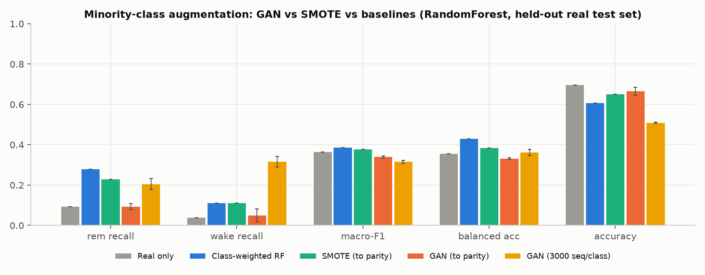
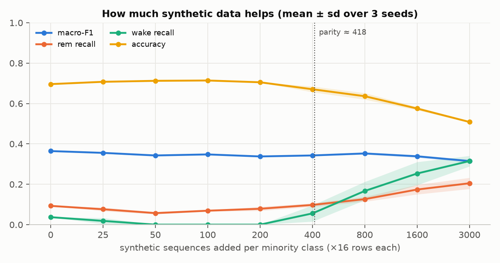

**Reading it honestly**

- GAN augmentation **does** move minority recall: wake recall rises from 0.037 to 0.315 (8.5x) and REM from 0.093
  to 0.205, the largest wake recall of any method tested.
- It gets there by volume, not by sharper decision boundaries. At the default setting the GAN adds 48,000 rows per
  minority stage against 7,080 real "light" rows, so the forest leans towards predicting the minority stages and
  accuracy drops to 0.508. At matched volume (parity, the same amount SMOTE adds) the GAN gives no recall gain.
  The sweep shows a smooth trade-off: every step up in synthetic volume buys minority recall and costs accuracy,
  with macro-F1 roughly flat (0.34 to 0.36) until the largest setting.
- On macro-F1 and balanced accuracy, class weighting and SMOTE are ahead of GAN augmentation on this task.
- Why: section 4 shows the four stages have nearly the same HR and SpO₂ distributions (means 62 to 64 bpm,
  about 92% SpO₂). A realistic generator reproduces that overlap faithfully, so extra samples cannot create
  separation that the features do not have. A second, smaller factor is that `train_gan.synth` draws the "hour"
  feature uniformly from 00:00 to 06:00 rather than from each stage's real timing.

**What this means for the project.** The GAN component works and is validated: it produces realistic,
stage-conditioned physiology (section 4), which is useful for privacy-safe data sharing, simulation of the
digital twin, and stress-testing alerts. As a class-balancing tool for single-minute features, it is a
recall-vs-accuracy dial rather than a free improvement. The most promising next steps are to (1) use the GAN to
augment the sequence-level classifier, where its temporal realism is actually used, (2) condition the generator
on time of night, and (3) add movement or HR-variability features that separate the stages better.

---

## Files

| Path | Contents |
|---|---|
| `results/summary.json` | headline metrics from `run_all.py` |
| `results/forecaster_metrics.json`, `sleep_metrics.json`, `gan_metrics.json`, `transitions.json`, `gan_config.json` | per-model metrics from training |
| `results/eval/eval_metrics.json` | every test number in this document |
| `results/fig_*.png` | figures produced during training |
| `results/eval/fig_eval_*.png` | figures produced by testing |
| `results/train_log.txt`, `results/eval_log.txt` | full console output with hardware and software versions |
| `*.pt` checkpoints | kept out of git (see `.gitignore`); shared separately as `caretwin_results.zip` |

## Reproduce

```bash
git clone https://github.com/mommand/EDT-Datasets.git ml/EDT-Datasets
pip install torch --index-url https://download.pytorch.org/whl/cu128   # CUDA build (plain pip gives CPU-only on Windows)
pip install -r ml/requirements.txt
cd ml
python run_all.py  --src EDT-Datasets --out results   # train (about 51 min on an RTX 4050 Laptop GPU)
python evaluate.py --src EDT-Datasets --res results   # test + figures (about 5 min)
```
